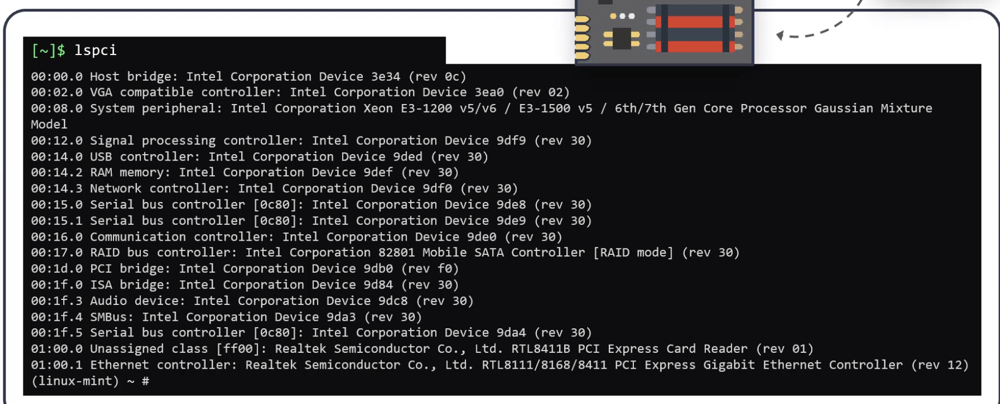
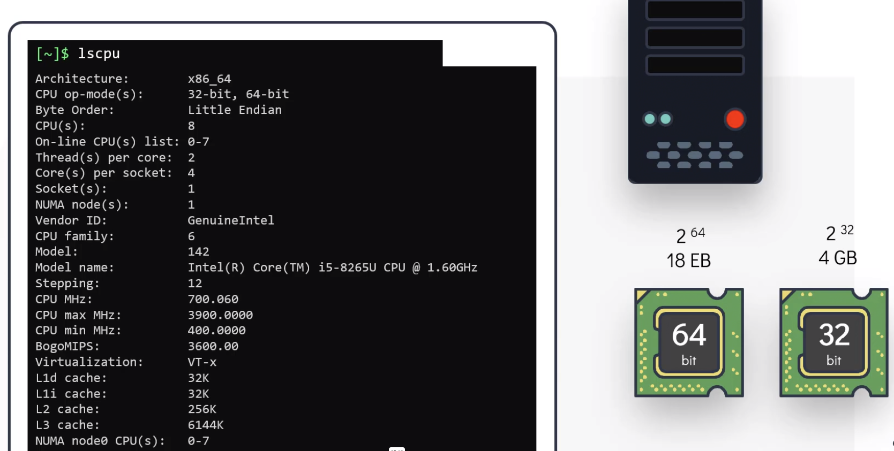
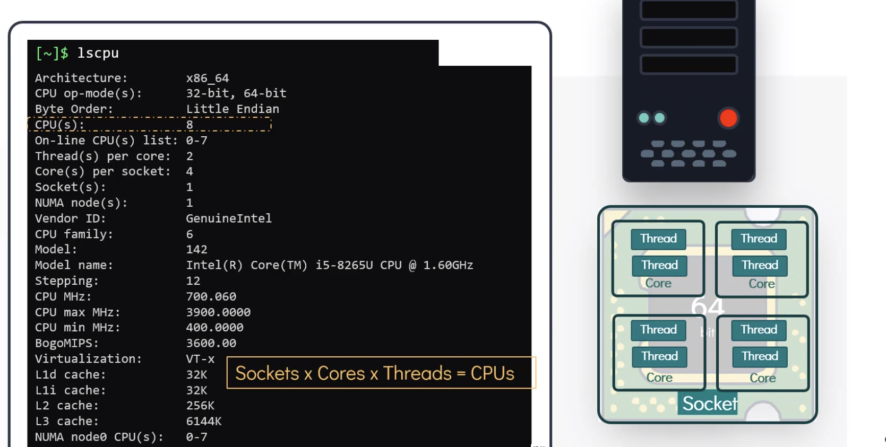
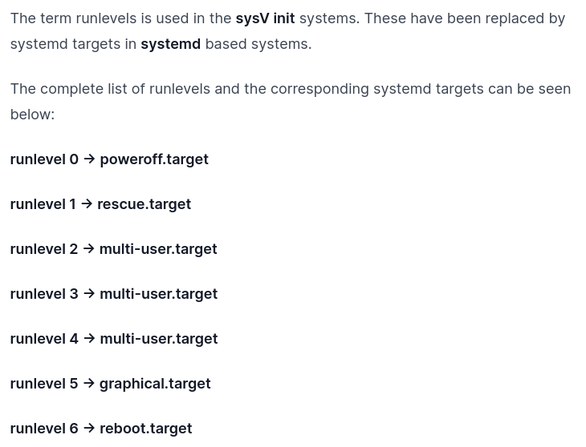
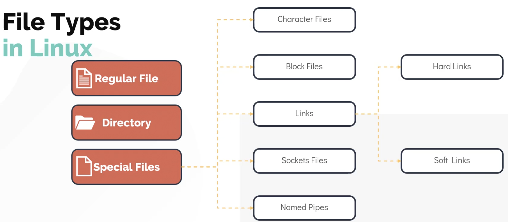

# Linux Basics

Learning Linux Basics Course & Labs from KodeKloud. https://kodekloud.com/courses/the-linux-basics-course/

**NOTE:** Everything listed here isn't present in any other Linux resources that I've done. The full content is availabe at https://github.com/kodekloudhub/linux-basics-course

## Working With The Shell Part 1

The `pushd` commands adds directories to a stack. You can add as many as you like. Use `popd` to return the latest directory from the stack. You can view the stack with `dirs`.

`udev` is a device manager for the Linux kernel. Whenever a device is added or removed, the kernel sends a `uevent`notification of the change to `udev`.

`uevents` occur when new hardware is detected, they are messages

`dmesg` is used to examine or control the kernel ring buffer.

 is used to control and query the udev database and events.

`udevadm`

`lspci` prints detailed information about all PCI buses and devices in the system.

`lsblk` prints information about block devices, partitions and filesystems.

`lscpu` prints information about the CPU.

The socket is the physical slot on the motherboard.
The core is how many phyiscal CPUs.
The threads is how many logical CPUs per CPU core.
The total CPU amount is sockets x cores x threads.

`lsmem` prints information about the RAM.

`lshw` prints detailed information about all hardware.

There are 4 high level steps to the boot process:
1. BIOS POST
   1. Basic Input/Output System - Power On Self Test. This is done by the computer's hardware.
2. Boot loader, e.g. GRUB 2.
   1. The first sector of the disk points to the boot loader which is stored in `/boot`. The boot loader is responsible for starting the kernel.
   2. The kernel is stored in a compressed state to save disk space.
3. Kernel initialisaion.
   1. The compressed kernel is loaded into memory and is decompressed. The kernel performs a series of startup steps. The final step is loading the system initialisation process.
4. System initialisation, e.g. systemd. Sys5 was replaced by systemd.
   1. This sets up the user space.

Use `ls -l /sbin/init` to see which system initialisastion proces is being used.

The 2 most common run levels are:
* 3 for the shell.
* 5 for GUI.

`systemctl get-default`  shows what the current run level is and `systemctl set-default $LEVEL` changes the run leve.

There are 3 types of files in Linux:
1. Regular files,
2. Directories,
3. Special files.

There are 5 special file types:
1. Character files are serial devices in `/dev` like the mouse and keyboard.
2. Block files are block storage devices in `/dev` like HDD and RAM.
3. Links:
   1. Hard Links
   2. Symbolic LInks
4. Socket files enable communication between two processes. e.g. a Unix socket for `localhost` connectivity.
5. Named Pipes allow data to flow from one process to another. e.g. `$CMD1 | $CMD2`

The file attributes in `ls -l` are:

A software package is a compressed archive that contains all the files required by a particular software to run.

The manifest contains the information required for that particular software to run correctly. Package managers use this file to install dependencies.

`apt` and the original `apt-get` are the frontend of the `dpkg` package manager. Similarly, `dnf` and the original `yum` are the frontend of the `rpm` package manager.

## Working With The Shell Part 2