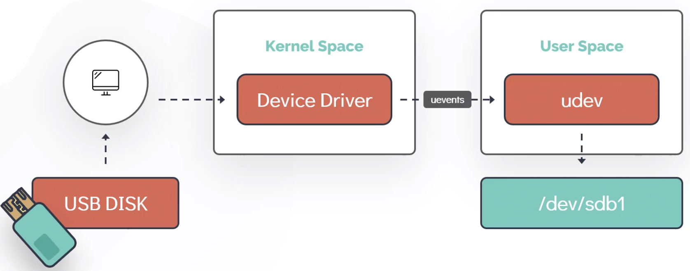
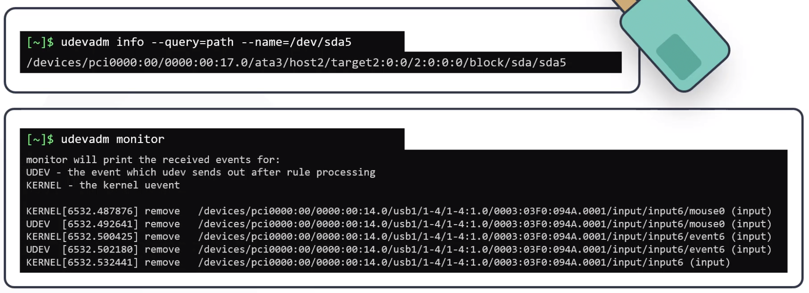
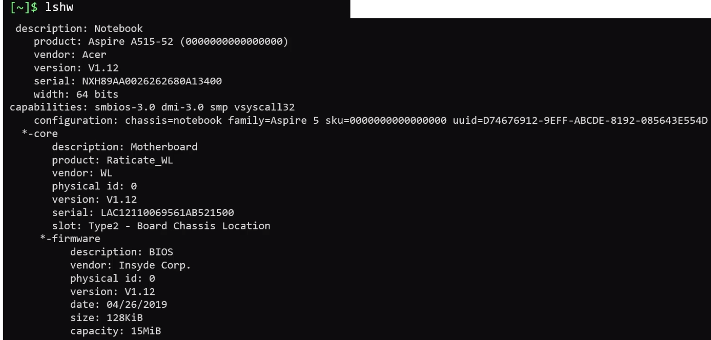
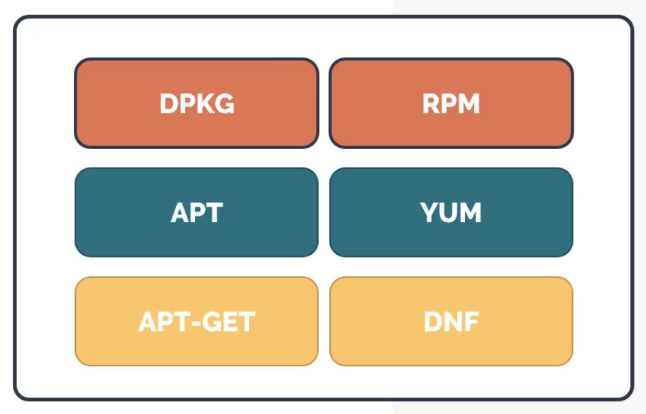
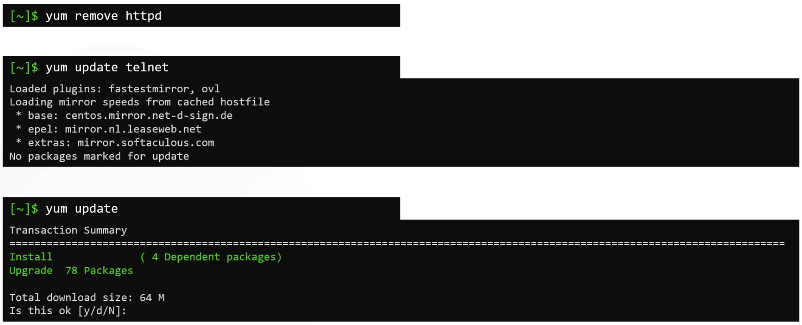
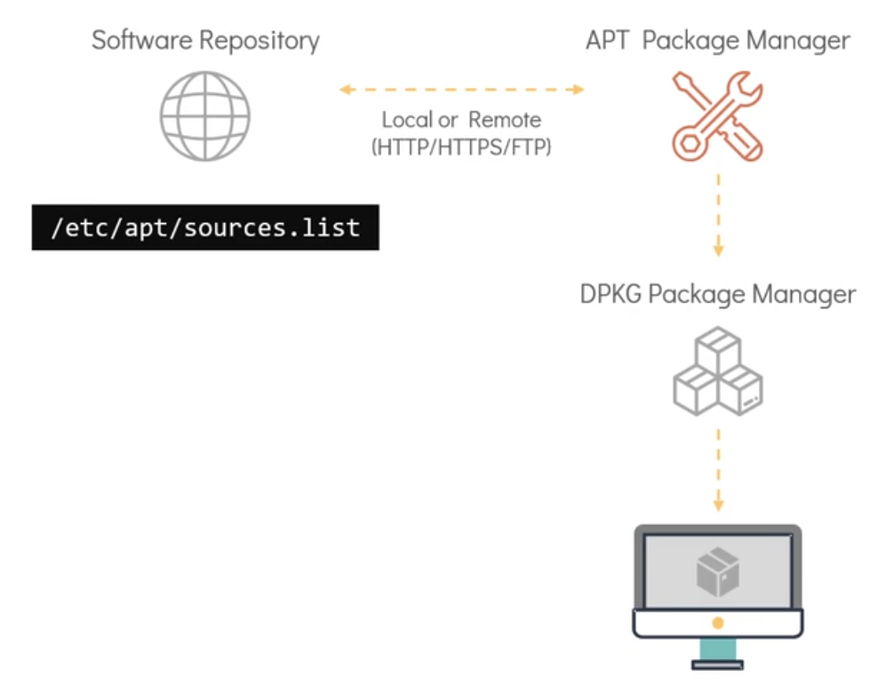
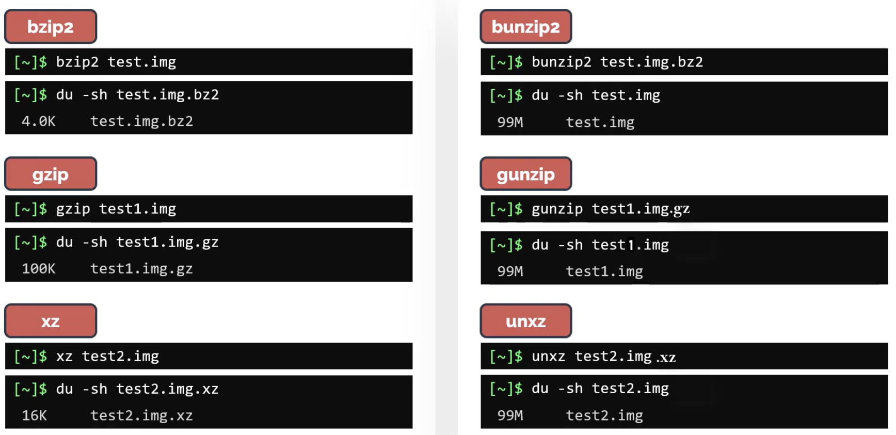
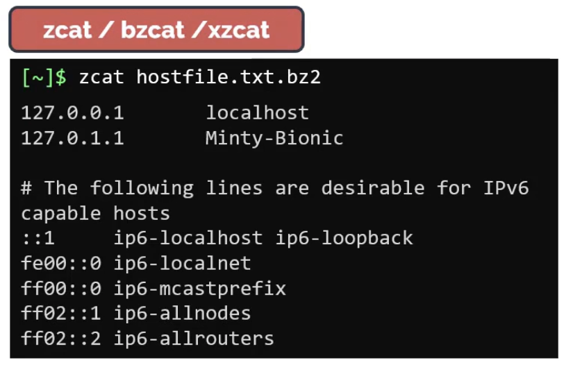
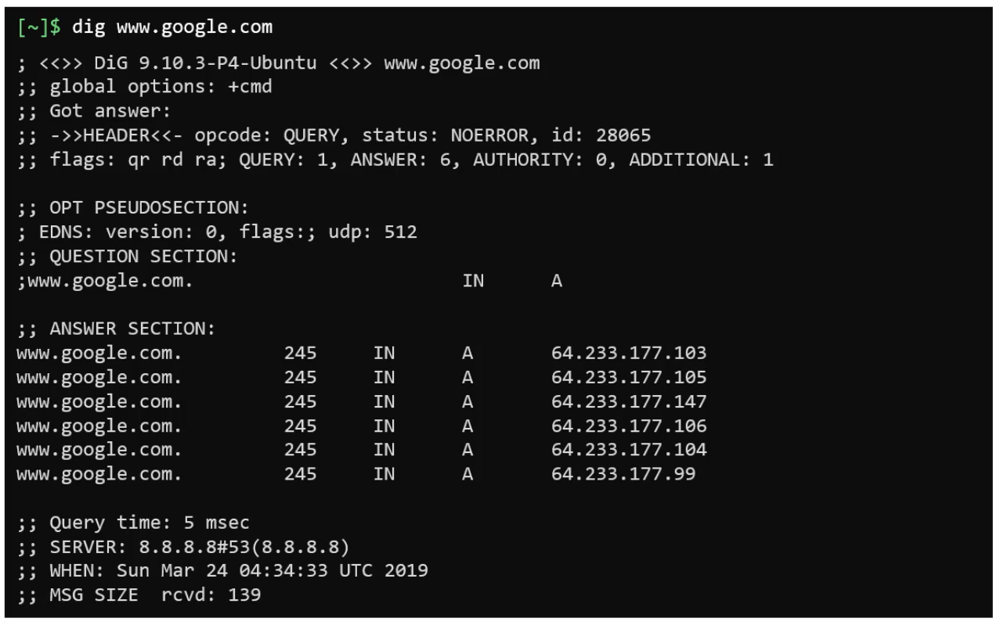

Linux Basics <!-- omit in toc -->
============

Learning Linux Basics Course & Labs from KodeKloud. https://kodekloud.com/courses/the-linux-basics-course/

**NOTE:** Everything listed here isn't present in any other Linux resources that I've done. The full content is availabe at https://github.com/kodekloudhub/linux-basics-course

- [Working With The Shell Part 1](#working-with-the-shell-part-1)
- [Working With The Shell Part 2](#working-with-the-shell-part-2)
  - [Anki cards needed below this line.](#anki-cards-needed-below-this-line)
- [Networking](#networking)
- [Security \& File Permissions](#security--file-permissions)
- [Service Management](#service-management)
- [Storage](#storage)

# Working With The Shell Part 1

The `pushd` commands adds directories to a stack. You can add as many as you like. Use `popd` to return the latest directory from the stack. You can view the stack with `dirs`.


`udev` is a device manager for the Linux kernel. Whenever a device is added or removed, the kernel sends a `uevent`notification of the change to `udev`.



`uevents` occur when new hardware is detected, they are messages

`dmesg` is used to examine or control the kernel ring buffer.

 is used to control and query the udev database and events.

`udevadm`



`lspci` prints detailed information about all PCI buses and devices in the system.


`lsblk` prints information about block devices, partitions and filesystems.


`lscpu` prints information about the CPU.


The socket is the physical slot on the motherboard.
The core is how many phyiscal CPUs.
The threads is how many logical CPUs per CPU core.
The total CPU amount is sockets x cores x threads.


`lsmem` prints information about the RAM.


`lshw` prints detailed information about all hardware.



There are 4 high level steps to the boot process:
1. BIOS POST
   1. Basic Input/Output System - Power On Self Test. This is done by the computer's hardware.
2. Boot loader, e.g. GRUB 2.
   1. The first sector of the disk points to the boot loader which is stored in `/boot`. The boot loader is responsible for starting the kernel.
   2. The kernel is stored in a compressed state to save disk space.
3. Kernel initialisaion.
   1. The compressed kernel is loaded into memory and is decompressed. The kernel performs a series of startup steps. The final step is loading the system initialisation process.
4. System initialisation, e.g. systemd. Sys5 was replaced by systemd.
   1. This sets up the user space.


Use `ls -l /sbin/init` to see which system initialisastion proces is being used.


The 2 most common run levels are:
* 3 for the shell.
* 5 for GUI.


`systemctl get-default`  shows what the current run level is and `systemctl set-default $LEVEL` changes the run leve.


There are 3 types of files in Linux:
1. Regular files,
2. Directories,
3. Special files.


There are 5 special file types:
1. Character files are serial devices in `/dev` like the mouse and keyboard.
2. Block files are block storage devices in `/dev` like HDD and RAM.
3. Links:
   1. Hard Links
   2. Symbolic LInks
4. Socket files enable communication between two processes. e.g. a Unix socket for `localhost` connectivity.
5. Named Pipes allow data to flow from one process to another. e.g. `$CMD1 | $CMD2`


The file attributes in `ls -l` are:


A software package is a compressed archive that contains all the files required by a particular software to run.


The manifest contains the information required for that particular software to run correctly. Package managers use this file to install dependencies.


`apt` and the original `apt-get` are the frontend of the `dpkg` package manager. Similarly, `dnf` and the original `yum` are the frontend of the `rpm` package manager. These frontends provide dependency resolution and other advanced features.



The Red Hat Package manager uses `.rpm` files and has 5 main methods:
1. Installing `rpm -i $RPM_FILE`
2. Uninstalling `rpm -e $RPM_FILE`,
3. Upgrading `rpm -U $PACKAGE`,
4. Querying `rpm -q $PACKAGE` to query the `/var/lib/rpm` database,
5. Verifying `rpm -V $PACKAGE`.

`/etc/yum.repos.d/redhat.repo` points to the official Red Hat repository.


`yum repolist` shows all repositories in the system.


`yum provides $PACKAGE` shows which repo provides `$PACKAGE`.




The Debian Package manager uses `.deb` files and has 5 main methods:
1. Installing `dpkg -i $DEB_FILE`
2. Uninstalling `dpkg -i $DEB_FILE`,
3. Upgrading `dpkg -l $PACKAGE`,
4. Querying `dpkg -s $PACKAGE`,
5. Verifying `dpkg -p $PACKAGE_PATH`.

`/etc/apt/sources.list` contains repositories.



`apt edit-sources` opens `/etc/apt/sources.list` in a text editor for editing.

`apt search $PACKAGE` to search for a package.

`apt list | grep $PACKAGE` to search all available packages.

Use `apt` over `apt-get`.

# Working With The Shell Part 2

Anki cards needed below this line.
---

File compression is a process of reducing the size of one or more files to make them smaller and more manageable. This is typically done to save storage space, reduce bandwidth usage when transmitting files over networks, and speed up file transfers.

There are 3 popular compression tools in Linux:
1. `bzip2` which can be uncompressed with `bunzip2`.
2. `gzip` which can be uncompressed with `gunzip`.
3. `xz` which can be uncompressed with `unxz`.



You can work with compressed files with tools like:
* `zcat`, `bzcat`, and `xzcat`.
* `zless`, `bzless`, and `xzless`.
* `zgrep`, `bzgrep`, and `xzgrep`.
* `zdiff`, `bzdiff`, and `xzdiff`.



Use `locate $FILENAME` to search for a file in a database of paths. You can update this database with `updatedb`. This requires M-locate DB to be installed.


`grep -v $STRING` can be used to match all lines that don't have `$STRING`.

`grep -w $WORD` can be used to search for words boundaries.

`update-alternatives --display editor` shows which editor is being used.

# Networking

By default the `/etc/hosts` file takes precedence over the `/etc/resolv.conf` file. This can be changed with `/etc/nsswitch.conf` and the `hosts:` section.

The DNS server can also be configured to forward unresolvable traffic elsewhere.


Adding `search $DOMAIN` into `/etc/resolv.conf` simplifies hostname resolution by automatically appending domain suffixes to hostnames, thereby reducing the need for fully qualified domain name entries in various network commands.


`nslookup` ignores `/etc/hosts` when doing DNS resolution. `dig` is an alternative to `nslookup`.



A switch can only deliver packets within the same network. A router is needed to forward packets between networks.


A gateway is needed to define where to send packets outside of the network, i.e. to a router.

The `route` command output can be read as follows:
* Destination: This column shows the destination network or IP address. It indicates where packets are being routed.
* Gateway: This column displays the IP address of the gateway (router) that packets should be sent to in order to reach the destination network.
  * `Gateway *` or `Gateway 0.0.0.0` in the route output indicates that the route is directly connected, and packets destined for the specified network can be sent directly through the associated network interface without involving a gateway router.
* Genmask (Netmask): This column specifies the netmask associated with the destination network. It determines the size of the network that the route applies to.
* Flags: These are flags that describe the route's properties, such as whether it's a host-specific route (U for up), a gateway route (G), or a dynamically created route (D).

```
Kernel IP routing table
Destination     Gateway         Genmask         Flags Metric Ref    Use Iface
default         192.168.1.1     0.0.0.0         UG    100    0        0 eth0
192.168.1.0     *               255.255.255.0   U     0      0        0 eth0
```

* `default`: This route directs all packets with no specific route match to 192.168.1.1, which is the default gateway.
* `192.168.1.0`: This route indicates that packets destined for the 192.168.1.0/24 network (i.e., IP addresses from 192.168.1.1 to 192.168.1.254) should be sent directly through the eth0 interface.

`ip` commands are not persistent unless they are added to the `/etc/network` file.

Use `ip link set dev $NIC up` to enable an interface.

Use `ip route add default via $IP_ADDRESS` to add a default route.

These are the basic network troubleshooting steps:
* Check your interface is up with `ip -c -h a`
* Check DNS is working with `nslookup $HOSTNAME`
* Check if you can `ping` the remote host. This may be blocked though.
* Check if there are any network problems between you and the host with `traceroute $IP` or `mtr $IP`
* Connect to the host and check if the interface is up with `ip -c -h a`
* Connect to the host and check if the service is running with `ss -lntp` or `ss -untp`.


# Security & File Permissions

# Service Management

# Storage
